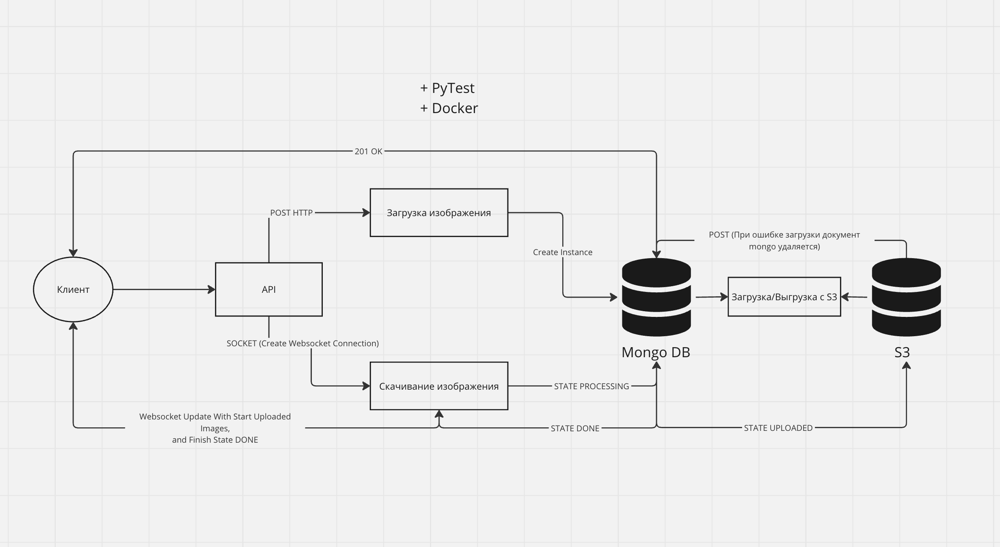
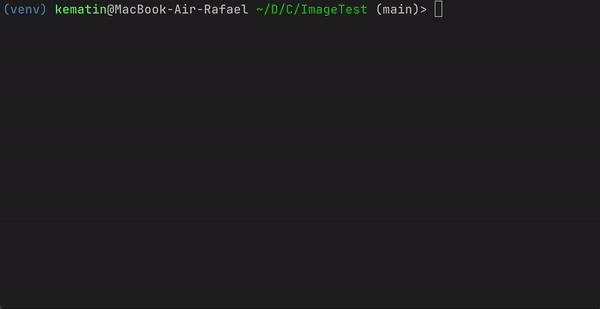
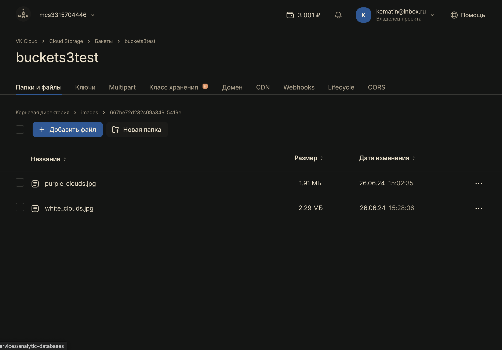

# Image parse

upload image to s3 + websocket notification for connection client

```bash
python3.10 -m venv venv
source venv/bin/activate
pip install -r req.txt
python parse/main.py
```
Schema:



Upload to s3 example:


Websocket connection example:



Bucket:


