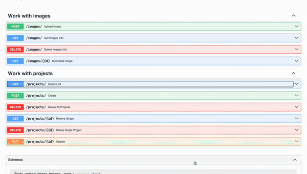

# Image parse

upload image to s3 + websocket notification for connection client

```bash
python3.10 -m venv venv
source venv/bin/activate
pip install -r req.txt
python parse/main.py
```
Schema:


Upload to s3 example:



Websocket connection example:


Bucket:


